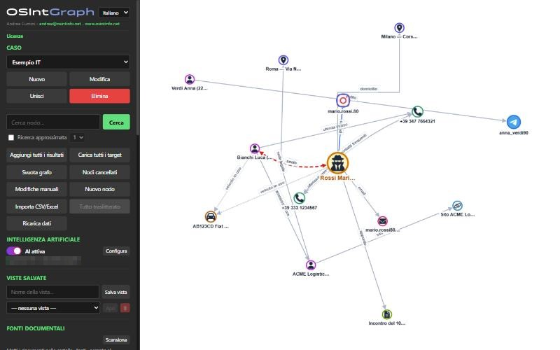
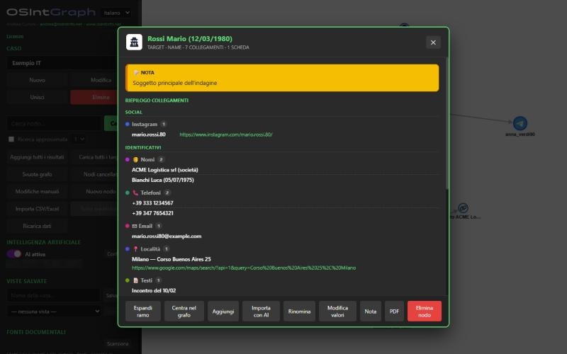
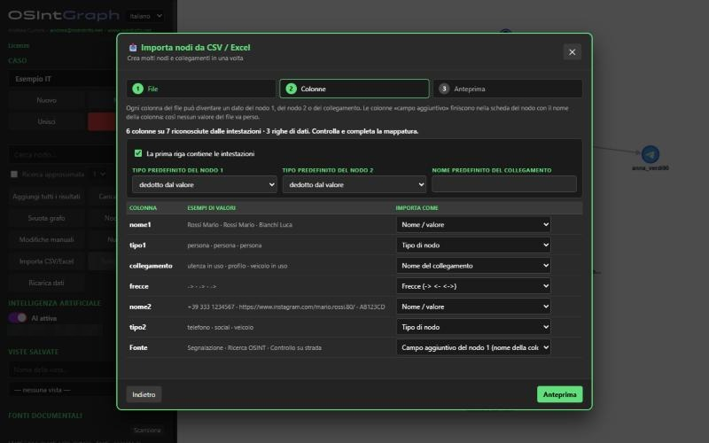

<p align="center">
  <picture>
    <source media="(prefers-color-scheme: dark)" srcset="static/logo.svg">
    
  </picture>
</p>

# OSInt Graph

Visual exploration of OSINT data for investigative cases: people, phones,
e-mails, social profiles, vehicles, places and documents as an interactive
graph, with everything stored locally on your computer.

- **Graph of a case**: every item is a node, every relation a connection.
  Click to expand or collapse a node, right-click for its card, drag and zoom.
- **Cases**: each investigation is a separate archive (SQLite). Create, edit,
  merge and delete cases; the program starts empty and asks you to create one.
- **Node cards**: notes, grouped summary of connections, raw records, images,
  one-click copy of every value, PDF export of the card.
- **Create and connect**: add any kind of node (person, phone, e-mail, social
  account recognised from its URL, vehicle, place with address and
  coordinates, link, text, photo, investigative items), mark any node as a
  target, connect nodes with named, styled and directed links (arrowheads set
  by clicking the preview).
- **Guided CSV / Excel import**: three steps, column mapping with automatic
  recognition of headers in Italian and English, unknown columns kept as
  extra fields of the node, preview before import.
- **Document sources**: index PDF, Word, Excel, CSV, text and images (OCR
  with Tesseract, downloadable from the program on Windows) and search them
  from the panel or from a node card.
- **Optional AI**: an Ollama- or OpenAI-compatible server of your choice can
  turn free text into proposed nodes and transliterate non-Latin names.
  Off by default; nothing is sent anywhere unless you enable it.
- **Views, filters, layouts, export**: saved views, category filters,
  organic / circular / hierarchical / grid layouts, graph and table export
  to PDF.
- **Six languages**: Italian, English, French, German, Spanish, Arabic
  (right-to-left), with a built-in illustrated user manual in all of them.



<p align="center">
  
  
</p>

## Quick start

Requires Python 3.10+.

```
pip install -r requirements.txt
python app.py
```

A local server starts and the browser opens on http://127.0.0.1:5000. On the
first run create a case, then search, add nodes or import a CSV. The folder
`esempi/` contains two sample files (Italian and English data) ready to
import; the illustrated manual is available from the **Manuale / User manual**
link in the left panel.

The server listens only on this computer. All data stays next to the
program:

| Folder / file | Content |
|---|---|
| `data/` | the archive: cases, transliteration dictionary, sources index |
| `data/media/` | images uploaded into photo nodes |
| `fonti/` | documents to index for the search in sources |
| `chatbot.conf` | optional AI configuration (see `chatbot.conf.example`); keep it private |
| `tools/tesseract/` | Tesseract OCR, downloaded by the program on request |

### Windows executable

```
pip install -r requirements.txt -r requirements-build.txt
python build_app.py
```

`dist/` then contains `OSIntGraph.exe` together with `LICENSE`, `NOTICE`,
`THIRD-PARTY-NOTICES.md` and `chatbot.conf.example`: distribute them together.
The executable creates `data/` next to itself on first run.

## How it works

- `app.py` — Flask server: graph building, cases, import, sources, AI bridge
- `store.py` — SQLite archive, one database per case
- `sources.py` — text extraction and OCR for the document sources
- `ontology.py`, `ontology_i18n.py` — node types and investigative items
- `static/app.js`, `static/i18n.js`, `static/style.css`, `templates/index.html` — the web interface (Cytoscape.js)
- `static/manual/` — the user manual in six languages
- `scripts/make_licenses.py` — regenerates the licence texts shown in the program

## Privacy

OSInt Graph processes personal data gathered from open sources. Everything is
kept locally and the program makes no network connection, except to the AI
server you configure yourself when the AI switch is on. Whoever uses the
program is responsible for complying with the data-protection and
investigation laws that apply to them.

## License

Copyright (C) 2025-2026 Andrea Cumini — andrea@osintinfo.net — www.osintinfo.net

Free software under the **GNU General Public License v3** with additional
terms (author attribution, name and logo): see [LICENSE](LICENSE) and
[NOTICE](NOTICE). Third-party libraries, icons and tools keep their own
licences, listed in [THIRD-PARTY-NOTICES.md](THIRD-PARTY-NOTICES.md) and
readable from the program (link **Licenze**).

The names and logos of the social platforms shown next to profiles are
trademarks of their respective owners and are used only to identify the
platform of a profile. This project is not affiliated with any of them.
The logo is set in Panchang by Indian Type Foundry (outlines only; the font
is not distributed).

---

## Italiano

OSInt Graph rappresenta come grafo interattivo le informazioni di un caso
investigativo — persone, telefoni, email, profili social, veicoli, luoghi e
documenti con i loro collegamenti — tenendo tutto sul proprio computer.

- **Casi** separati, ognuno con il proprio archivio; il programma parte vuoto
  e chiede di creare il primo caso.
- **Grafo**: un clic espande o contrae un nodo, il tasto destro apre la scheda
  con note, riepilogo dei collegamenti, dati e immagini.
- **Nodi e collegamenti**: qualsiasi tipo di nodo, qualsiasi nodo può essere
  evidenziato come target, collegamenti con nome, forma, colore e frecce
  impostate cliccando sull'anteprima.
- **Importazione guidata da CSV/Excel** con mappatura delle colonne e
  anteprima; file di esempio nella cartella `esempi/`.
- **Fonti documentali** indicizzate e cercabili (PDF, Word, Excel, testo,
  immagini con OCR).
- **AI facoltativa** (server Ollama o OpenAI-compatibile scelto da te) per
  creare nodi da un testo e traslitterare i nomi; spenta non invia nulla.
- **Sei lingue** e manuale illustrato integrato.

Avvio dal sorgente: `pip install -r requirements.txt` e `python app.py`; il
browser si apre su http://127.0.0.1:5000. Eseguibile Windows con
`python build_app.py`. Licenza GNU GPL v3 con obbligo di attribuzione: vedi
[LICENSE](LICENSE), [NOTICE](NOTICE) e [THIRD-PARTY-NOTICES.md](THIRD-PARTY-NOTICES.md).
